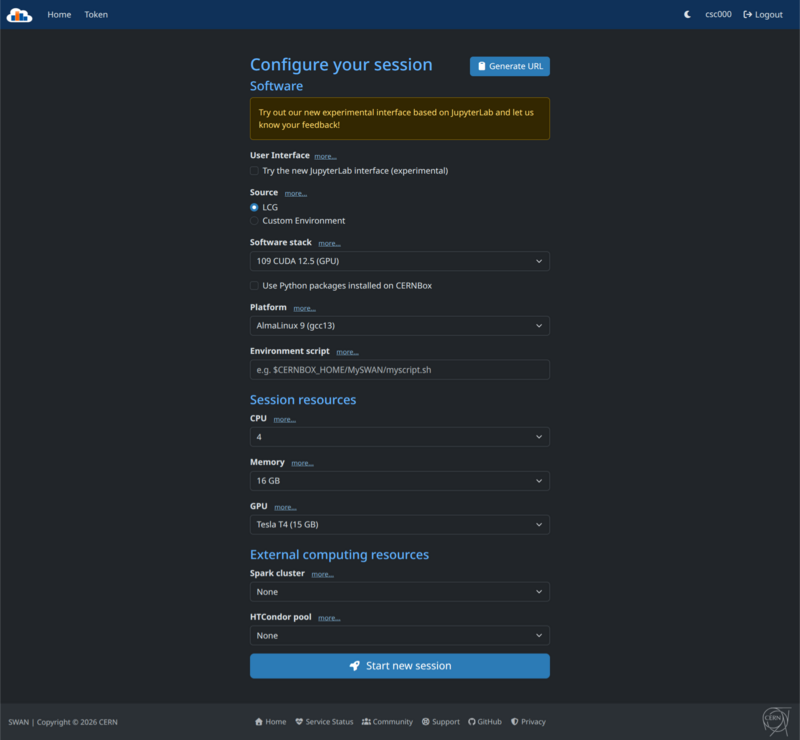
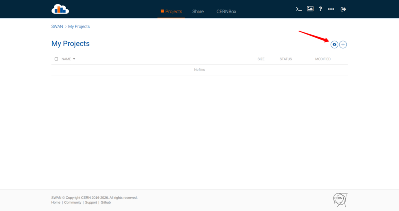
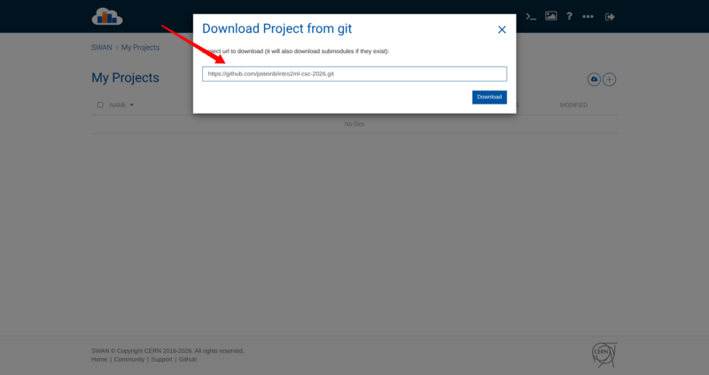
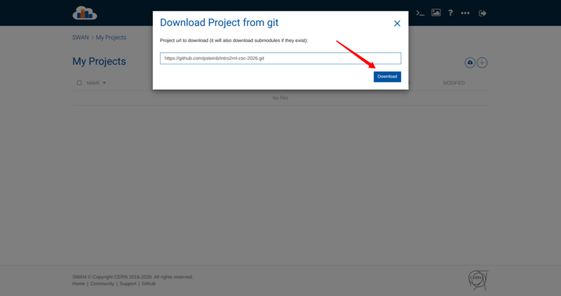
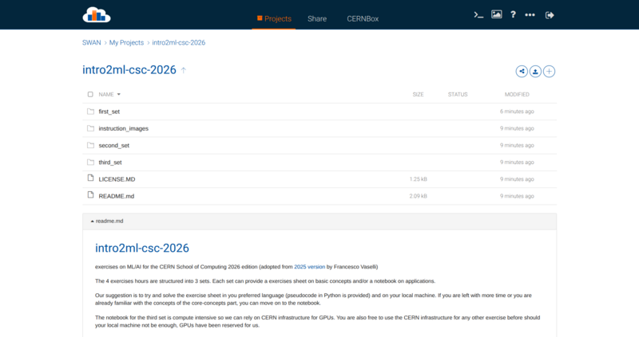

# intro2ml-csc-2026

exercises on ML/AI for the CERN School of Computing 2026 edition (adopted from [2025 version](https://github.com/francesco-vaselli/intro2ml-csc-2025) by Francesco Vaselli)

The 4 exercises hours are structured into 3 sets. Each set can provide a exercises sheet on basic concepts and/or a notebook on applications. 

Our suggestion is to try and solve the exercise sheet in you preferred language (pseudocode in Python is provided) and on your local machine. If you are left with more time or you are already familiar with the concepts of the core-concepts part, you can move on to the notebook. 

The notebook for the third set is compute intensive so we can rely on CERN infrastructure for GPUs. You are also free to use the CERN infrastructure for any other exercise before should your local machine not be enough, GPUs have been reserved for us.

## Set up with SWAN

### Enter [SWAN](https://swan.cern.ch)

Authenticate with your csc26 account.

### Download the git repository [github.com/psteinb/intro2ml-csc-2026](https://github.com/psteinb/intro2ml-csc-2026)

### Insert Repo URL

### Confirm Download

### The code is now downloaded

## Curriculum

- Mon, Aug 31
    - Lecture 1, 11:30am -> Course1
    - Lecture 2, 12:30pm -> Course2 
- Tue, Sep 01
    - Exercise 1, 12:30pm -> Intro DecisionTrees (Peanuts and Higgs Search) in [exercise01](exercise01/)
    - Exercise 2, 15:30pm -> Bias Variance Tradeoff in [exercise02](exercise02/)
- Wed, Sep 02
    - Lecture 3, 8:45am -> Course3, NNs+backprop 
    - Exercise 3, 9:45am -> MLPs in pytorch (backprop by hand, train an MLP) [exercise03](exercise03/)
    - Lecture 4, 2:30pm -> Course3
    - Exercise 4, 4:00pm -> CNNs [exercise04](exercise04/)
- Thu, Sep 03
    - Lecture 5, 2:30pm -> VAEs
